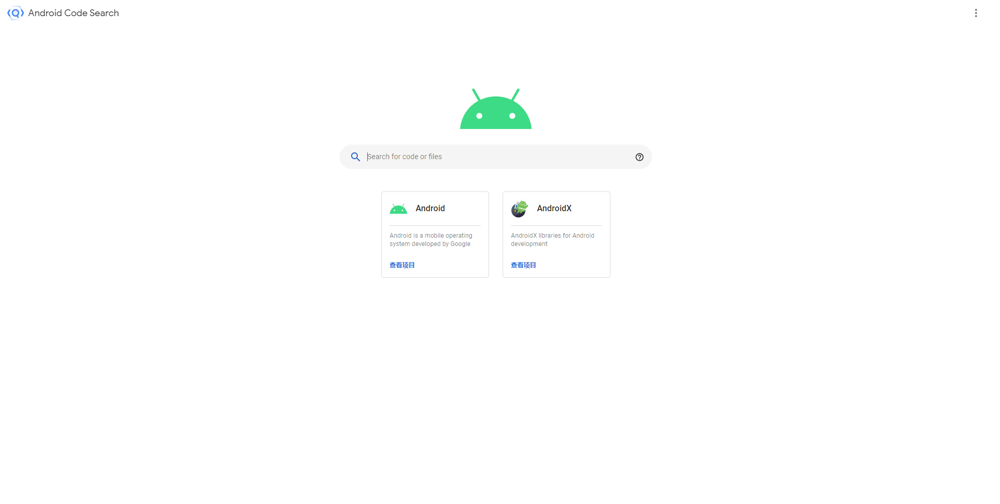

查阅 Android 源代码一直都是 Android 相关开发者亘古不变的需求

以往查看源代码的时候需要通过将源码下载到本地或查阅一些在线的 xref 网站，而这些方法都对开发者很不友好：

Android 源码非常大，并且因为一些众所周知的原因，下载速度也非常慢

xref 网站的搜索功能极其垃圾，在打开比较大的源码文件时还经常会卡死浏览器

<!-- more -->
Google 终于在去年年底推出了官方的代码查阅平台：[Android Code Search](https://cs.android.com/) (梯)

官方介绍：

Android 代码搜索是一款可帮助开发者查看实际使用的 Android 源代码的工具。
利用代码搜索，您可以点击源代码的一部分到另一部分，从而更轻松地在所有 AOSP 中浏览交叉引用。这有助于您在 Android 的开源分支之间切换。只有主分支在 Java 和 CPP 中有交叉引用信息，而 Go 则没有。

除了搜索 Android 项目的代码之外，该代码搜索工具还同时提供了 AndroidX 库的源代码码搜索。

更多说明请查阅：[Link](https://source.android.google.cn/setup/contribute/code-search)