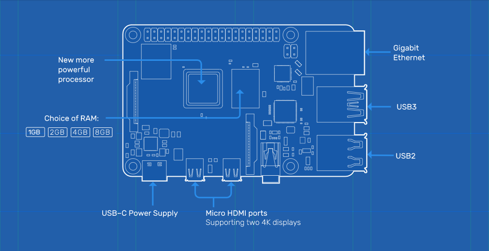
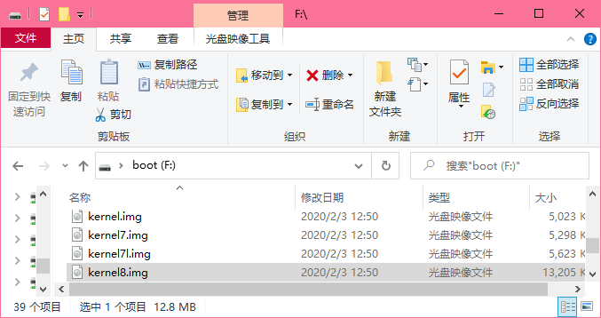
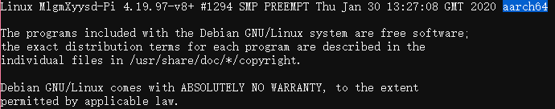

[树莓派](https://www.raspberrypi.org/) 是一个价格实惠（大概吧）的开发板，目前已经出到了第4代。就硬件性能上来说，树莓派4已经达到了办公级别

但是，32 位的 Raspbian 系统严重拖了 Raspberry Pi 4B 的后腿
<!-- more -->
实际上，官方已经在最新的 Raspbian 上更新了 arm64 的内核，如果你的型号在下面的表格中，都可以使用 armv8(arm64) 的内核来提升性能

型号 | 版本 | 处理器
:-: | :-: | :-:
Raspberry Pi 4B | - | Broadcom BCM2711, Quad core ARM Cortex-A72 (ARM v8) 64-bit SoC @ 1.5GHz
Raspberry Pi 3B+ | - | Broadcom BCM2837B0, Quad core ARM Cortex-A53 (ARM v8) 64-bit SoC @ 1.4GHz
Raspberry Pi 3A+ | - | Broadcom BCM2837B0, Quad core ARM Cortex-A53 (ARM v8) 64-bit SoC @ 1.4GHz
Raspberry Pi 3B | - | Broadcom BCM2837, Quad core ARM Cortex-A53 (ARM v8) 64-bit SoC @ 1.2GHz
Raspberry Pi 2B | rev1.2 | Broadcom BCM2837, Quad core ARM Cortex-A53 (ARM v8) 64-bit SoC @ 1.2GHz

首先先检查一下 `/boot`(FAT32分区) 中是否有 `kernel8.img`，如果没有，请先运行 `sudo rpi-update` 更新至最新版系统或 [下载最新系统镜像](https://www.raspberrypi.org/downloads/raspbian/)

如果有，打开 `config.txt`，将 `arm_64bit` 的值修改为 `1`(一般是在文件末尾添加 `arm_64bit=1`)

>[官方文档](https://www.raspberrypi.org/documentation/configuration/config-txt/boot.md)
>**arm_64bit**
>If set to non-zero, forces the kernel loading system to assume a 64-bit kernel, starts the processors up in 64-bit mode, and sets kernel8.img to be the kernel image loaded, unless there is an explicit kernel option defined in which case that is used instead. Defaults to 0 on all platforms. NOTE: 64-bit kernels must be uncompressed image files. 
>Note that the 64-bit kernel will only work on the Pi4, Pi3, and Pi2B rev1.2 boards with latest firmware. 
>如果设置为非零，则强制内核加载系统采用64位内核，以64位模式启动处理器，并将 kernel8.img 设置为加载的内核映像，除非在这种情况下定义了显式 kernel 选项，否则将使用该选项。在所有平台上默认为0。注意：64位内核必须是未压缩的镜像文件 
>注：64位内核只能在具有最新固件的 Pi4, Pi3和Pi2B rev1.2 开发板工作。

保存，重启

内核已经变成了 aarch64，现在可以运行 arm64 架构的程序了，大功告成！

---

2020.6.1 更新：

树莓派官方已经在5月28日发布2020-05-27版的arm64**测试版**镜像，但实测下来许多软件包都没有适配，期待树莓派真正arm64的那一天

[官方论坛](https://www.raspberrypi.org/forums/viewtopic.php?f=117&t=275370)

[镜像下载](https://downloads.raspberrypi.org/raspios_arm64/images/raspios_arm64-2020-05-28/2020-05-27-raspios-buster-arm64.zip)